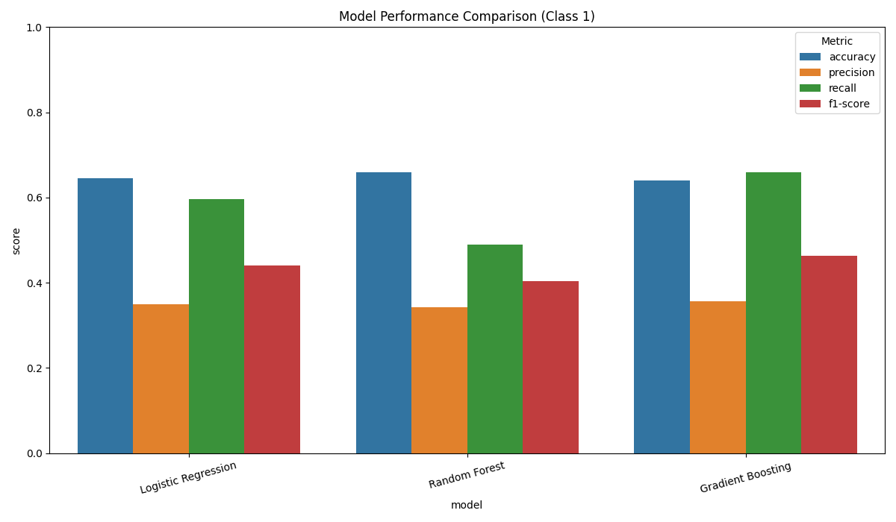
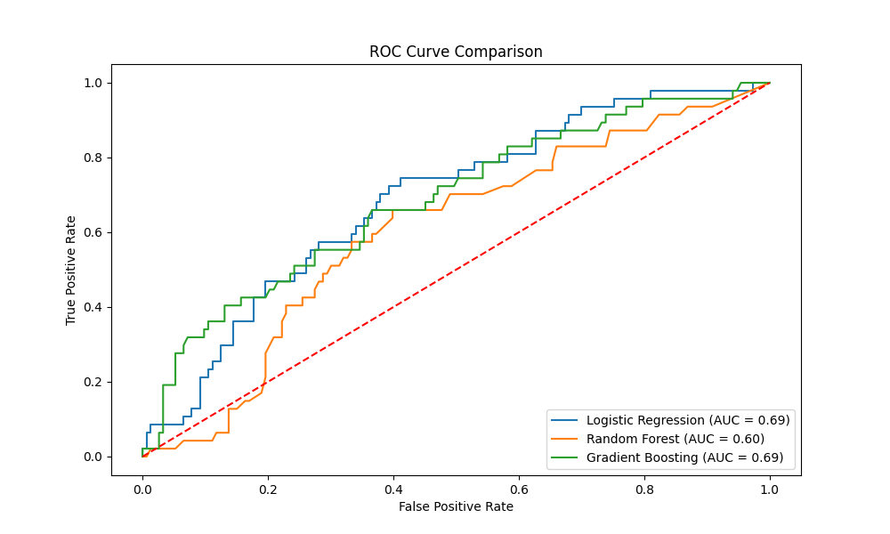

# Genetic Risk Prediction Pipeline for Neurodevelopmental Disorders

## Project Overview

This project is a bioinformatics pipeline designed to analyze genetic variants associated with Autism Spectrum Disorder (ASD) and Attention-Deficit/Hyperactivity Disorder (ADHD). The pipeline integrates genetic data with intervention response data to build predictive models of genetic risk.

## Visual Analysis

*Figure 1: Comparison of performance metrics across the three machine learning models after handling class imbalance with SMOTE.*


*Figure 2: Comparison of the ROC curves for the three machine learning models.*


### Personal Motivation

I'm passionate about leveraging computational tools to understand the genetic underpinnings of complex neurological disorders. This project is a way for me to explore this interest and showcase my skills in data engineering, statistical analysis, and machine learning in a bioinformatics context. I'm particularly interested in the potential for genetic data to inform personalized medicine and improve outcomes for individuals with neurodevelopmental disorders.

### Learning Objectives

Through this project, I aim to:

*   Develop a deeper understanding of the genetic architecture of ASD and ADHD.
*   Gain hands-on experience with common bioinformatics tools and data formats.
*   Build a robust and scalable data analysis pipeline.
*   Apply machine learning techniques to predict genetic risk.
*   Effectively communicate my findings through visualizations and documentation.

## Project Structure

```
├── data/
│   ├── raw/
│   └── processed/
├── scripts/
│   ├── __init__.py
│   ├── data_generation.py
│   └── analysis.py
├── src/
│   ├── __init__.py
│   └── utils.py
├── results/
│   ├── figures/
│   └── tables/
├── .gitignore
├── README.md
├── requirements.txt
└── genetic_pipeline_plan.md
```

## Methodology

The pipeline consists of the following steps:

1.  **Data Generation:** Synthetic data for genetic markers, clinical phenotypes (ASD/ADHD diagnosis), and intervention response is generated using the `scripts/data_generation.py` script. This script creates a dataset with realistic characteristics, including missing values and outliers.

2.  **Data Preprocessing:** The `scripts/analysis.py` script loads the raw data, merges the different data sources, and handles missing values using median imputation for numeric features and mode imputation for categorical features.

3.  **Polygenic Risk Score (PRS) Calculation:** A simple PRS is calculated as a weighted sum of risk alleles for each individual. The weights are randomly generated for this demonstration.

4.  **Statistical Analysis:** T-tests are performed to compare the PRS between cases and controls for both ASD and ADHD.

5.  **Machine Learning:** Three different machine learning models are trained to predict ADHD diagnosis from the PRS, age, and sex:
    *   Logistic Regression
    *   Random Forest
    *   Gradient Boosting

    The models are trained on 80% of the data and evaluated on the remaining 20%.

## Getting Started

### Prerequisites

*   Python 3.8+
*   Virtualenv (or your preferred virtual environment manager)

### Installation

1.  **Clone the repository:**

    ```bash
    git clone https://github.com/your-username/genetic_risk_pipeline.git
    cd genetic_risk_pipeline
    ```

2.  **Create and activate a virtual environment:**

    ```bash
    python -m venv venv
    source venv/bin/activate
    ```

3.  **Install the required packages:**

    ```bash
    pip install -r requirements.txt
    ```

## Usage

The pipeline is run via scripts in the `scripts/` directory.

1.  **Generate synthetic data:**

    ```bash
    python scripts/data_generation.py
    ```

2.  **Run the analysis pipeline:**

    ```bash
    PYTHONPATH=$PYTHONPATH:. python scripts/analysis.py
    ```

3.  **Generate visualizations:**

    ```bash
    PYTHONPATH=$PYTHONPATH:. python scripts/visualization.py
    ```

## Results

The pipeline generates a variety of outputs in the `results/` directory, providing a comprehensive overview of the data and analysis. The key results are visualized below:

*   **Tables (`results/tables/`):**
    *   `data_summary.csv`: A summary of the preprocessed data.
    *   `statistical_analysis_results.csv`: The results of the statistical analysis.
    *   `model_comparison.csv`: A comparison of the performance of the different machine learning models.
    *   `logistic_regression_model.joblib`, `random_forest_model.joblib`, `gradient_boosting_model.joblib`: The saved machine learning models.
    *   `analysis.log`: A log file for the analysis script.
    *   `visualization.log`: A log file for the visualization script.

*   **Figures (`results/figures/`):**
    *   A subset of histograms for key variables (e.g., `rs1`, `rs50`, `rs100`).
    *   A correlation matrix heatmap.
    *   A subset of boxplots for outlier detection.
    *   An age distribution comparison plot.
    *   `feature_importance_comparison.png`: A comparison of feature importances across all models.
    *   `roc_curve_comparison.png`: The ROC curve comparison chart shown above.
    *   `model_performance_comparison.png`: The bar chart shown above.

## Project Plan

The project is divided into three phases:

1.  **Foundation & Core Data Pipeline:** Setting up the project, generating synthetic data, and building the core analysis pipeline.
2.  **Advanced Analysis & Machine Learning:** Performing statistical analysis, developing machine learning models, and creating visualizations.
3.  **Integration & Professional Documentation:** Documenting the project, creating presentation materials, and preparing for portfolio integration.

## Contributing

This is a personal project, but I'm open to feedback and suggestions. If you have any ideas, feel free to open an issue or submit a pull request.
